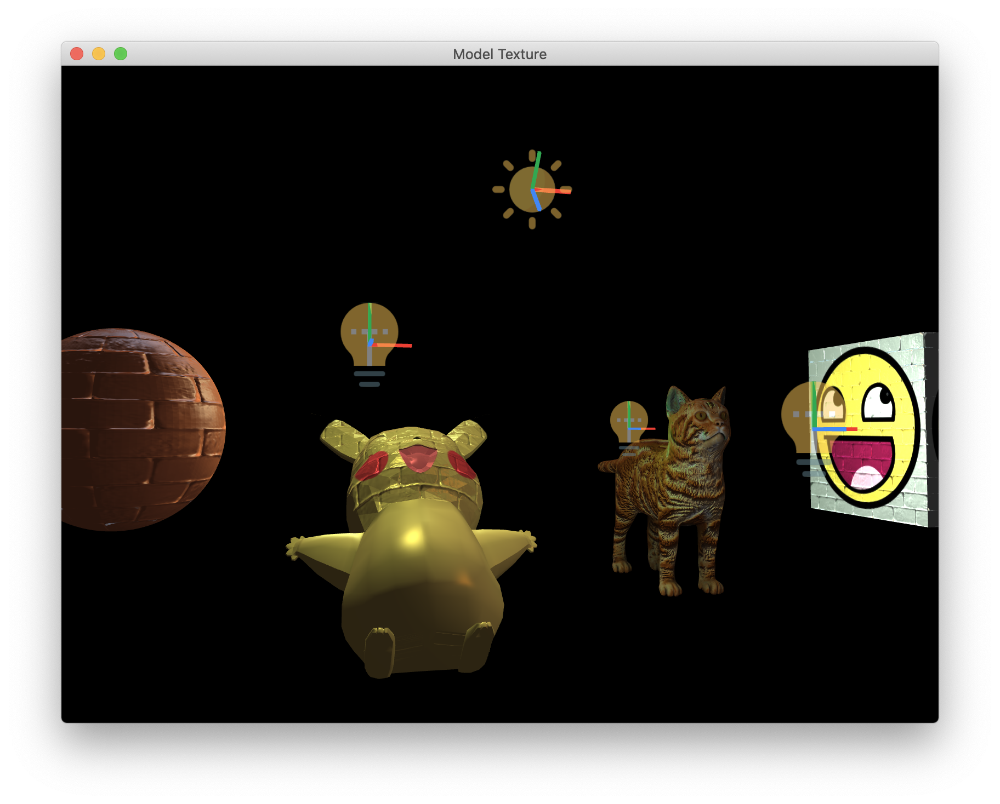

# OpenGL Grocery

Learning and Practice of Modern OpenGL.


## Prerequisites

### Build Tools

- GCC/Clang (C++ 11 supported)
- CMake

### On macOS

Install packages listed below via *Homebrew*. In addition, you may also need to install *Xcode*, which encompasses C/C++ build tools and essential frameworks for development.

```bash
brew install glew
brew install glfw3
```

### On Ubuntu

Install packages below via *apt-get*.

```bash
sudo apt-get install cmake libx11-dev xorg-dev libglu1-mesa-dev freeglut3-dev libglew1.5 libglew1.5-dev libglu1-mesa libglu1-mesa-dev libgl1-mesa-glx libgl1-mesa-dev libglfw3-dev
```


## Build & Run

Type commands below to download and build the project.

```bash
# Clone this repo
git clone https://github.com/yuehaowang/lets_openGL.git
# Get into the project directory
cd ./lets_openGL
# Create a build/ directory
mkdir build
cd build/
# Build
cmake ..
make
```

If you manage to build the project, you can run binaries as below:

```bash
# Draw a triangle
triangle/triangle

# Bind textures to 2D geometries
texture/texture

# Draw a 3D geometry
3d_geom/3d_geom

# Test mathematical computation
math_test/math_test

# Bind textures to 3D geometries
cube_texture/cube_texture

# Phong shading
lighting/lighting

# Model loading + texture & normal mapping
model_texture/model_texture

```


## Attributions

### Third-party Libraries

- [stb_image](https://github.com/nothings/stb)
- [tiny_obj_loader](https://github.com/tinyobjloader/tinyobjloader)

### Resources

Some resources used in this project are downloaded online. Here are their attributions.

- Sun icon made by [DinosoftLabs](https://www.flaticon.com/authors/dinosoftlabs) from [www.flaticon.com](https://www.flaticon.com/)
- Lamp icon made by [Pixelmeetup](https://www.flaticon.com/authors/pixelmeetup) from [www.flaticon.com](https://www.flaticon.com/)</a>
- Cat model downloaded from [free3d.com](https://free3d.com/3d-model/cat-v1--522281.html)


## Notes

### Row-major v.s. Column-major order

`mat` in GLSL reads input data in column-major order instead of row-major order, e.g. `mat2(1, 2, 3, 4)` will construct a matrix like

```math
1  3
2  4
```

Therefore, matrices stored in row-major order should be transposed before sent to shader programs. A more general way is to set the 3rd parameter of `glUnifromMatrixXXX` to `GL_TRUE`. Also note, some mathematical frameworks like *glm* stores matrices in column-major order and `mat[i][j]` gives element at column *i* and row *j*, which is different from the mathematical convention.


## Demo

Model loading, texture & normal mapping and lighting.



## License

[The GNU General Public License v3.0](https://www.gnu.org/licenses/gpl-3.0.en.html)


## References

- [Learn OpenGL](https://learnopengl.com/)
- [OpenGL Projection Matrix](http://www.songho.ca/opengl/gl_projectionmatrix.html)
- [WebGL Fundamentals](https://webglfundamentals.org/)
- [How to install OpenGL environment on Ubuntu](https://medium.com/@Plimsky/how-to-install-a-opengl-environment-on-ubuntu-e3918cf5ab6c)
- [CMake Examples](http://ttroy50.github.io/cmake-examples/)
- Dunn, Fletcher, and Ian Parberry. 3D math primer for graphics and game development. Jones & Bartlett Publishers, 2010.
